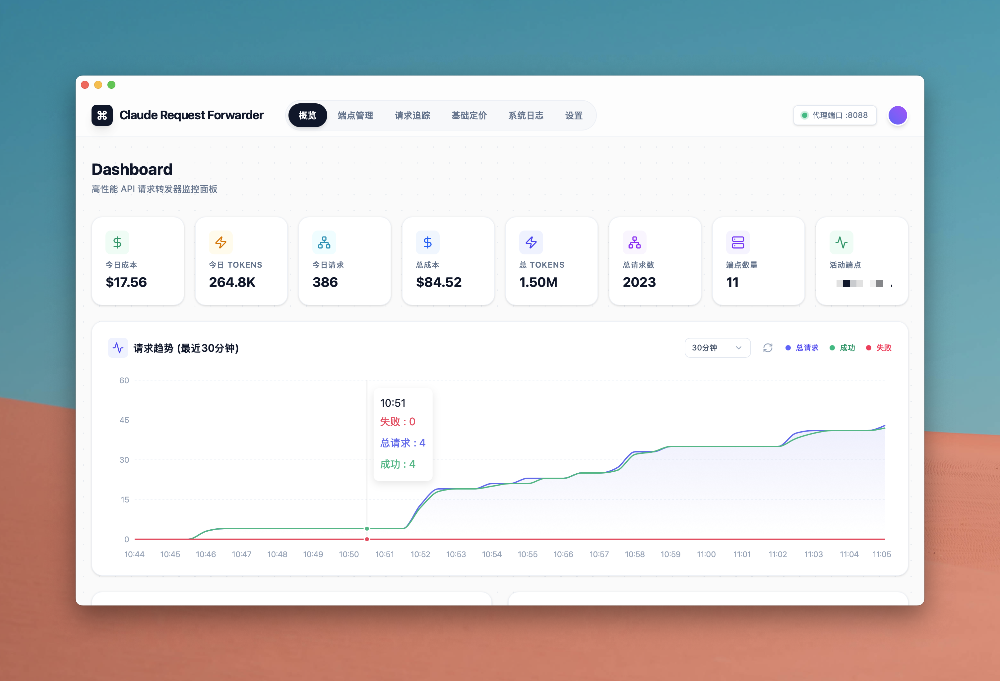
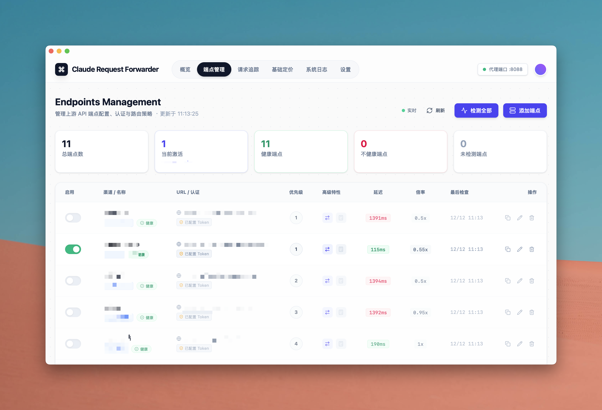
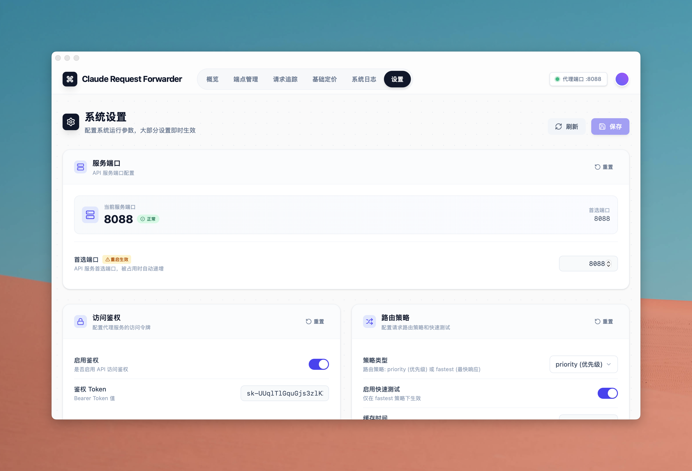

# CC-Forwarder Desktop

<p align="center">
  
</p>

<p align="center">
  <strong>Claude API 智能转发代理</strong><br>
  多端点负载均衡 · 自动故障转移 · 实时使用统计
</p>

<p align="center">
  
  
  
  
  
</p>

---

## 概述

CC-Forwarder Desktop 是一款基于 [Wails](https://wails.io) 构建的跨平台桌面应用，专为 Claude API 用户设计。它作为本地代理运行，提供智能请求转发、多端点管理、自动故障恢复等企业级功能，同时记录完整的使用统计和成本数据。

### 为什么需要它？

- **多账号/多端点管理** - 统一管理多个 API 端点，无需频繁切换配置
- **高可用保障** - 主端点故障时自动切换到备用端点，确保服务不中断
- **成本透明** - 实时追踪 Token 用量和费用，支持不同端点设置成本倍率
- **请求可观测** - 完整的请求生命周期追踪，便于问题排查



## 功能特性

### 🚀 智能转发引擎

- **优先级路由** - 按优先级自动选择最优端点
- **故障转移** - 端点异常时自动切换，支持配置冷却时间
- **端点自愈** - 持续监测故障端点，恢复后自动重新启用
- **流式传输** - 完整支持 SSE 流式响应，零延迟透传

### 📊 使用统计

- **实时监控** - Token 用量、请求成功率、响应时间一目了然
- **成本追踪** - 自动计算费用，支持按端点设置成本倍率
- **历史记录** - 完整的请求日志，支持筛选和导出
- **可视化图表** - 请求趋势图，直观展示使用情况

### 🎛️ 端点管理

- **可视化配置** - 图形界面管理端点，无需编辑配置文件
- **渠道分组** - 按渠道标签组织端点，清晰分类
- **状态监控** - 实时显示端点健康状态和响应延迟
- **灵活配置** - 支持自定义请求头、超时时间、成本倍率等

### 🔧 其他特性

- **请求生命周期追踪** - 从接收到完成的全程状态管理
- **热池架构** - 内存缓存 + 异步写入，高性能低延迟
- **本地存储** - SQLite 数据库，无需额外依赖
- **跨平台** - macOS、Windows、Linux 全平台支持

## 截图

| 概览 | 端点管理 |
|:---:|:---:|
|  |  |

| 请求追踪 | 设置 |
|:---:|:---:|
|  |  |

## 快速开始

### 方式一：下载安装包

从 [Releases](https://github.com/你的用户名/cc-forwarder-desktop/releases) 页面下载：

| 平台 | 文件 |
|------|------|
| macOS (Intel) | `CC-Forwarder-darwin-amd64.zip` |
| macOS (Apple Silicon) | `CC-Forwarder-darwin-arm64.zip` |
| Windows | `CC-Forwarder-windows-amd64.zip` |
| Linux | `CC-Forwarder-linux-amd64.tar.gz` |

### 方式二：从源码构建

```bash
# 1. 安装 Wails CLI
go install github.com/wailsapp/wails/v2/cmd/wails@latest

# 2. 克隆项目
git clone https://github.com/你的用户名/cc-forwarder-desktop.git
cd cc-forwarder-desktop

# 3. 安装前端依赖
cd frontend && npm install && cd ..

# 4. 开发模式运行
wails dev

# 5. 构建生产版本
wails build
```

### 配置 Claude Code

启动应用后，在 Claude Code 中设置代理地址：

```bash
# 设置 API 代理地址（默认端口 9090）
claude config set --global apiBaseUrl http://127.0.0.1:9090
```

## 配置说明

### 端点配置

端点通过应用内「端点管理」页面进行管理，支持以下配置项：

| 配置项 | 说明 | 示例 |
|--------|------|------|
| 渠道 | 分组标签 | `官方`、`第三方` |
| 名称 | 唯一标识（不可修改） | `claude-primary` |
| URL | API 端点地址 | `https://api.anthropic.com` |
| Token | Bearer Token | `sk-ant-xxx` |
| 优先级 | 数字越小优先级越高 | `1` |
| 故障转移 | 是否参与自动切换 | `启用` |
| 成本倍率 | 费用计算倍率 | `1.0` |

### 全局配置

编辑 `config/config.yaml` 配置全局选项：

```yaml
# 时区设置
timezone: "Asia/Shanghai"

# 日志配置
logging:
  level: "info"              # debug, info, warn, error
  file_enabled: true
  file_path: "logs/app.log"
  max_file_size: "50MB"
  max_files: 10

# 流式传输
streaming:
  heartbeat_interval: "30s"
  read_timeout: "10s"
  response_header_timeout: "90s"  # Claude API 可能需要较长等待

# 使用统计
usage_tracking:
  enabled: true
  hot_pool:
    enabled: true             # 内存热池，提升写入性能
    max_age: "30m"
    max_size: 10000
```

## 技术架构

```
┌──────────────────────────────────────────────────────────────┐
│                      CC-Forwarder Desktop                     │
├──────────────────────────────────────────────────────────────┤
│                                                               │
│  ┌─────────────────────┐      ┌─────────────────────────┐   │
│  │   Frontend (React)  │      │     Backend (Go)        │   │
│  │                     │      │                         │   │
│  │  ├─ 概览仪表板      │◄────►│  ├─ HTTP 代理服务       │   │
│  │  ├─ 端点管理        │ Wails│  ├─ 端点管理器          │   │
│  │  ├─ 请求追踪        │ IPC  │  ├─ 请求生命周期管理    │   │
│  │  ├─ 系统日志        │      │  ├─ 使用量追踪          │   │
│  │  └─ 设置页面        │      │  └─ 事件推送系统        │   │
│  └─────────────────────┘      └─────────────────────────┘   │
│                                          │                    │
│                                          ▼                    │
│                               ┌─────────────────────┐        │
│                               │       SQLite        │        │
│                               │   ├─ 端点配置       │        │
│                               │   ├─ 请求日志       │        │
│                               │   ├─ 使用统计       │        │
│                               │   └─ 模型定价       │        │
│                               └─────────────────────┘        │
└──────────────────────────────────────────────────────────────┘

请求处理流程：
┌────────┐    ┌────────┐    ┌────────┐    ┌────────┐    ┌────────┐
│ Client │───►│ Proxy  │───►│Endpoint│───►│ Claude │───►│Response│
│Request │    │ Server │    │ Select │    │  API   │    │ Stream │
└────────┘    └────────┘    └────────┘    └────────┘    └────────┘
                  │              │                           │
                  ▼              ▼                           ▼
             ┌────────┐    ┌────────┐                  ┌────────┐
             │Tracking│    │Failover│                  │ Token  │
             │ Record │    │ Logic  │                  │ Parse  │
             └────────┘    └────────┘                  └────────┘
```

### 核心模块

| 模块 | 路径 | 职责 |
|------|------|------|
| 代理引擎 | `internal/proxy/` | 请求转发、流式处理、错误恢复 |
| 端点管理 | `internal/endpoint/` | 端点调度、健康检查、故障转移 |
| 使用追踪 | `internal/tracking/` | 热池缓存、数据库写入、统计查询 |
| 事件系统 | `internal/events/` | SSE 推送、状态同步 |
| 前端应用 | `frontend/` | React + Vite + TailwindCSS |

## 常见问题

<details>
<summary><b>Q: 代理启动后 Claude Code 连接失败？</b></summary>

1. 确认代理端口（默认 9090）没有被占用
2. 检查 Claude Code 的 `apiBaseUrl` 配置是否正确
3. 确认至少配置了一个可用端点

</details>

<details>
<summary><b>Q: 如何查看请求日志？</b></summary>

应用内「请求追踪」页面可以查看所有请求记录，支持按时间、状态、模型等筛选。详细日志文件位于 `logs/app.log`。

</details>

<details>
<summary><b>Q: 成本统计不准确？</b></summary>

1. 检查「基础定价」页面的模型定价是否正确
2. 如果使用第三方端点，需要设置对应的成本倍率

</details>

<details>
<summary><b>Q: 支持其他 AI API 吗？</b></summary>

目前专为 Claude API 设计和优化。理论上兼容 Claude API 格式的其他服务也可以使用。

</details>

## 开发计划

- [ ] 多语言支持（English）
- [ ] 请求重放功能
- [ ] 更多统计维度
- [ ] 自动更新

## 贡献

欢迎提交 Issue 和 Pull Request！

## 许可证

[MIT License](LICENSE)

## 致谢

- 本项目最初受 [xinhai-ai/endpoint_forwarder](https://github.com/xinhai-ai/endpoint_forwarder) 启发
- 感谢 [Wails](https://wails.io) 提供优秀的桌面应用框架
- 感谢所有开源库的贡献者

---

<p align="center">
  <sub>Made with ❤️ and mass vibe coding</sub>
</p>
